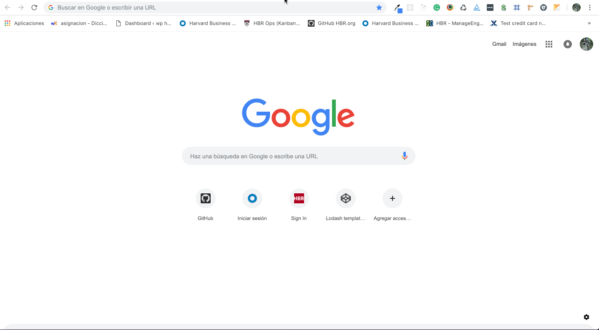

# __React Redux-Saga App__



## *__Installation__*
```
    git pull https://github.com/ivanxtr/React-Saga-App.git
    cd React-Saga-App/
    npm install
    npm start
    go to http://localhost:3000/
```

## Testing
```
npm run test 
```

## File Structure
https://marmelab.com/blog/2015/12/17/react-directory-structure.html
